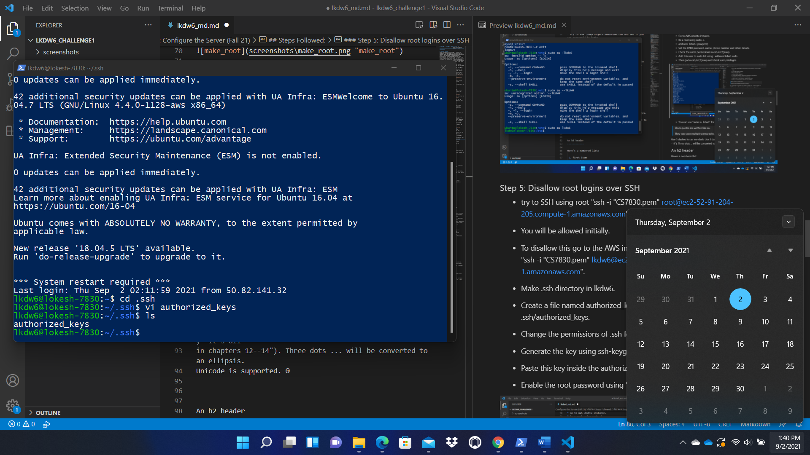
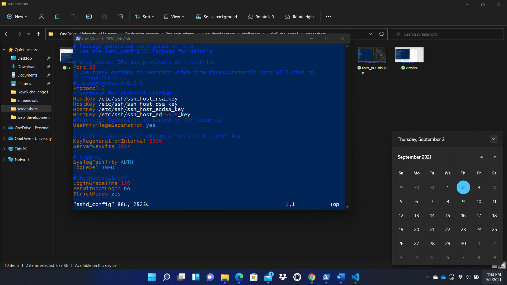
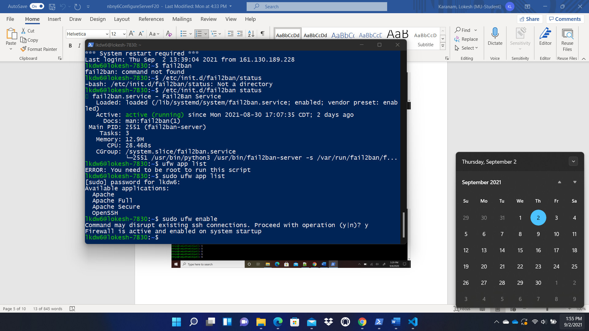
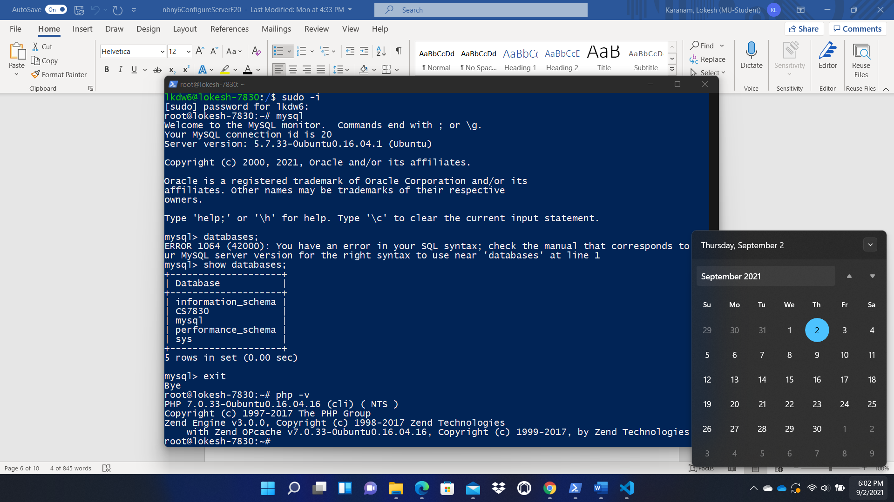

# Challenge 1 : Configure the Server (Fall 21)
                                Name : Lokesh Karanam
                                pawprint : lkdw6
======================================================================

## Tutorial Followed:
Inorder to complete this challenge, i followed the lectures of Professor wergeles in the class. I also watched his Fall 20 lectures that were on youtube. The setup was smooth and i didn't face any issues. During the course of this challenge, i learnt how to setup production level servers with high security. I'm so excited to learn what this course has to offer me in the further classes. My AWS public DNS is http://ec2-52-91-204-205.compute-1.amazonaws.com/ and the domain i purchased from namecheap.com is http://lokeshkaranam.me. I think i can learn a lot from this class if i follow and and keep on track with the progression of the class.

## Steps Followed:
### Step 1:
* Created an AWS ubuntu Instance with 28gb storage.
* Created a security group that allows SSH,HTTP and HTTPS for inbound rules.
* Downloaded the pem key file to the local for logging into the instance.
* AWS console and connection to my instance using the following command :
ssh -i "CS7830.pem" ubuntu@ec2-52-91-204-205.compute-1.amazonaws.com
* During the initial connection to the instance, we do not have any users created, so we use ubuntu user to login and then add users according to the requirements.

### Step 2: 

* After logging into the instance, the first thing we have to do is to upgrade and update the server. 
    * sudo apt update
    * sudo apt upgrade
* You can see the applicable apps which can be updated by using
    * apt list --upgradable
* Set the hostname
    * Go to root using sudo su
    * enter hostname -F /etc/hostname
    * echo "lokesh-7830 " > /etc/hostname
    * again do hostname -F /etc/hostname
    * Click "hostname" to see if the changes occured.
    * Restart the ubuntu server and you can see the changes.

* You can check the ubuntu version using : lsb_release -a

* in /etc/hosts file add the ip address of your AWS instance and the domain you will be using and the name.

### Step 3: Set date
* Do "date" in the command prompt and see the date.
* Change the date by going to root using sudo -i.
* Enter dpkg-reconfigure tzdata
* UI pops up and select the date from the dropdown.
* Set it to Central time.

### Step 4: Add limited user
* try to SSH 'pawprint@ec2.amazonaws.com and see if you can successfully login.
* Go to AWS ububtu instance.
* Be a root using sudo -i.
* add user lkdw6. (pawprint)
* Set the UNIX password, name, phone number and other details.
* Check the users permissions in cat /etc/group.
* Add this user to sudo list using : adduser lkdw6 sudo
* Then go to cat /etc/group and check user privileges.

* You can use "sudo su lkdw6" for making lkdw6 as the current root.

### Step 5: Disallow root logins over SSH
* try to SSH using root "ssh -i "CS7830.pem" root@ec2-52-91-204-205.compute-1.amazonaws.com".
* You will be allowed initially.
* To disallow this go to the AWS instance using your new user created by using "ssh -i "CS7830.pem" lkdw6@ec2-52-91-204-205.compute-1.amazonaws.com".
* Enable the root password using "passwd root"
* Make .ssh directory in lkdw6.
* Create a file named authorized_keys in .ssh folder using touch .ssh/authorized_keys.
* Change the permissions of .ssh folder using chmod 700 .ssh .
* Generate the key using ssh-keygen -y file_name.
* Paste this key inside the authorized_keys file.

* Go to root using sudo -i. 
* Open file vi /etc/ssh/sshd_config and change "Permit Root Login" to "no"

* Restart the service using ssh restart.
* Then you will see you have disabled root logins.

### Step 6: Setup Fail2Ban
* Go to your server using " ssh -i "CS7830.pem" lkdw6@ec2-52-91-204-205.compute-1.amazonaws.com"
* Install fail2ban using "sudo apt-get install fail2ban".
* This will not allow bruteforce attacks my blocking IPs if they try to login a number of times.

### Step 7: Setup the uncomplicated firewall ufw to allow SSH,HTTP,HTTPS
* 1.Run "sudo ufw status" to see if you get "OpenSSH", "Apache Full"
* Check the app list using "sudo ufw app list".

* Allow OpenSSH using "sudo ufw allow OpenSSH".
* Enable this using "sudo ufw enable".

* Install Apache using "sudo apt-get install apache2".
* sudo "Apache Secure" installs only HTTPS and sudo "Apache" installs only HTTP.
* we need to allow both HTTP and HTTPS so, we use "sudo ufw allow "Apache Full"". 
* Check status using "sudo ufw status". You will see OpenSSH and Apache Full will be enabled.

### Step 8: Install LAMP stack
* First install mysql using "sudo apt-get install mysql-server".
* Secure the mysql connection
    * sudo mysql_secure_installation
* Go to mysql using mysql command : mysql
* Use this command to create user : create user 'lkdw6'@'localhost' identified by 'password'; 
* Create database by using :create database dbname;
* grant select, insert, update on database.* to 'lkdw6'@'localhost';

* Install PHP using "sudo apt-get install php libapache2-mod-php php-mysql".

* After you are done restart the service using : sudo service apache2 restart.

### Step 9: Add limited user to www-data group
* run cat /etc/group to see if your pawprint is in the list of www-data group.

* Run sudo usermod -a -G www-data lkdw6 for setting up sudo for lkdw6. 

### Step 10: Lockdown permissions to public_html folder
* Run "ls -l /var/www/html" to see if the owner is your pawprint and the group owner is "www-data"  

* Run "ls -l /var/www/html" and see what the permissions are. it should be 775 or "drwxrwxr-x"
* Change the permissions to 775, using sudo chmod 775 /var/www/html
* Run "ls -l /var/www/html/index.html" to see if the permission on the files are 664 or "-rw-rw-r--"

* Create a new index.html file and put the default html in other file.
* The default html page has a lot of information on apache, config files, etc.

### Step 11: Create a Hello world page by replacing default HTML
* Created a demo html file.
* Loaded the file inside w3 validator and checked for any errors.

* Checked the errors line by line by inserting text

### Step 12: The demo of the websites on AWS public domain and personal domain
* AWS public DNS demo

* Personal website demo

## Below is the code i used for index.html page.

~~~html
<!DOCTYPE html>
<html lang="en">
    <head>
      <meta http-equiv="Content-Type" content="text/html; charset=utf-8" />
        <title>
            Lokesh Homepage
        </title>

    </head>
    <body>
      <ul>
        <li><a class="active" href="#home">Home</a></li>
        <li><a href=" http://ec2-52-91-204-205.compute-1.amazonaws.com" target="_blank">AWS DNS</a></li>
        <li><a href="http://lokeshkaranam.me" target="_blank">My Domain</a></li>
       
      </ul>
      

        <h1>CS 7830 Lets start</h1>
        
I did it!!!!!!!

        
 Hello everyone, this is Lokesh. I'm trying to learn the most i can here.
          Inorder to complete this challenge, i followed the lectures of Professor wergeles 
          in the class. I also watched his Fall 20 lectures 
          that were on youtube. The setup was smooth and i didn't 
          face any issues. During the course of this challenge,
           i learnt how to setup production level servers with 
           high security. I'm so excited to learn what this
            course has to offer me in the further classes.
             My AWS public DNS is <a href=" http://ec2-52-91-204-205.compute-1.amazonaws.com">AWS DNS</a>
             and the domain i purchased from namecheap.com is <a href=" http://lokeshkaranam.me">My domain</a>. 
             I think i can learn a lot from this class if i 
             follow and and keep on track with the progression 
             of the class. 
        

        
      

     
      
    </body>
</html>
~~~

